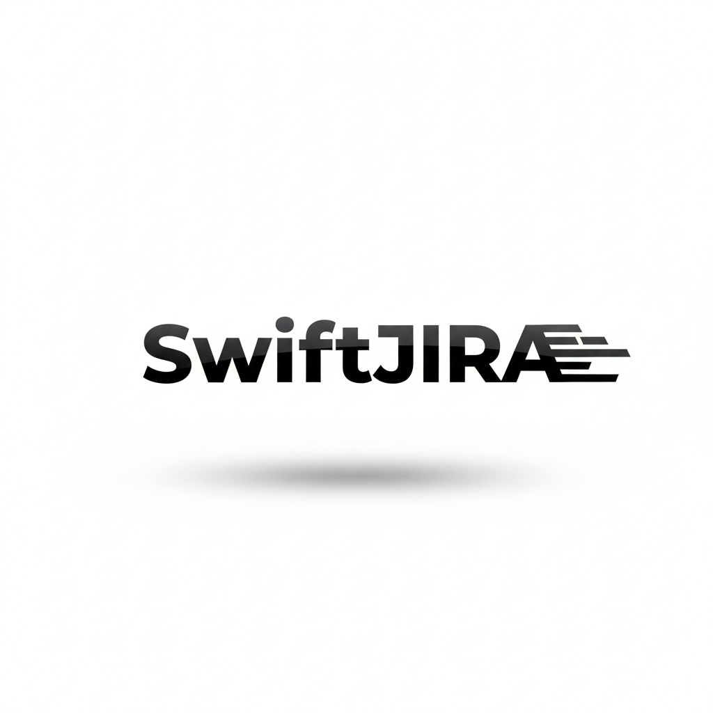

# JIRA_Automation
AI-assisted workflow for Business Analysts to **dictate requirements**, auto-generate **Descriptions and Acceptance Criteria**, and **update Jira** (Description + ACs) via **n8n**.  

<p align="center">
  
</p>

<p align="center">
  
  
  
  
</p>

---

# SwiftJIRA – Voice-Powered AI Automation for Jira Documentation

SwiftJIRA is a real-world AI automation pipeline that lets Business Analysts **update Jira tickets using their voice**. It converts speech into **structured Jira Descriptions and hierarchical Acceptance Criteria**, formatted to enterprise documentation standards.

This tool removes manual Jira typing, enforces consistency, and updates tickets automatically using the Jira REST API.

✅ Built for real enterprise workflows  
✅ Automates Jira story writing  
✅ Powered by AI Agents + n8n + Chrome Extension  
✅ Designed for scalable SDLC teams  

---

## 🚀 What It Does

| Feature | Description |
|----------|-------------|
| 🎙️ Voice Input | Record requirements using the Chrome Extension |
| 🤖 AI Automation | AI parses requirements and generates structured Jira content |
| 🧱 Description Builder | Enforces enterprise template: Functional Requirement, Usage, Notifications, Error Handling |
| ✅ Acceptance Criteria Writer | Generates hierarchical ACs (AC1, AC1.1, AC1.1.1…) |
| 🔄 Jira Sync | Auto-updates Jira fields via REST API |
| 🔗 n8n Workflow Orchestrator | Multi-agent pipeline feeds Jira updates |
| 🔐 Secure API Use | STT + OpenAI + Jira credentialed communication |

---

## 📸 Demo Video (MVP in Action)
🚧 **Demo video coming soon — placeholder section**  
_(Will embed video here once link is ready)_

---

## 🧩 System Overview

SwiftJIRA integrates **three major components**:

| Component | Purpose |
|-----------|---------|
| Chrome Extension | Front-end voice capture |
| n8n AI Workflow | Orchestrates AI agents and Jira integration |
| Jira Cloud API | Receives structured updates automatically |

n8n workflow based on `JIRABot.json` handles the automation logic intelligently.

---

## 🧠 AI Agent Design

SwiftJIRA uses **two specialized AI agents**:

| Agent | Role |
|--------|------|
| Description Agent | Builds structured Jira Descriptions by merging existing content + user voice instructions |
| Acceptance Criteria Agent | Generates full AC hierarchy + converts to valid Atlassian Document Format (ADF) for Jira |

These behaviors follow the rules defined in your AI Automation design.

---

## 🛡️ Security & Privacy

- Jira authentication secured with API Tokens
- API keys never stored in code, only in secure config
- Chrome Extension uses `chrome.storage.sync` for secure local key storage
- All data processed securely over HTTPS
- No personal data stored

---

## 💻 Tech Stack

```yaml
Voice Input: Chrome Extension (Manifest V3)
Speech-to-Text: fal.ai Whisper API
AI Models: OpenAI GPT-4.1 / GPT-5 Mini
Automation Engine: n8n Workflow Orchestration
APIs: Jira Cloud REST API
Code: JavaScript, Node.js, JSON, Atlassian ADF